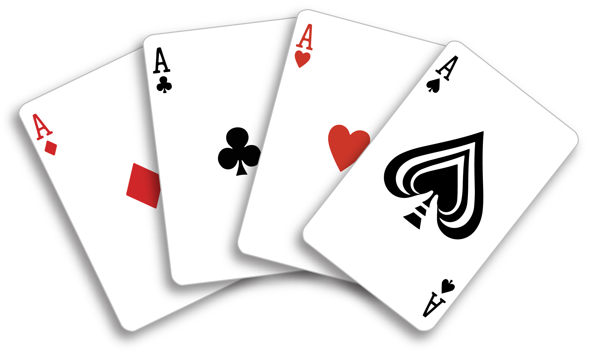

<p align="center">
  
</p>

Backend for a simple poker game. Springboard to more ambitious multi-player card games.

This is a hand-written project — I keep AI out of the day-to-day coding to stay sharp at writing code myself. The exceptions so far: AI handled the big framework upgrades (Angular 11 → 22 with Node 12 → 24, Spring Boot 2.3.4 → 4.1 with Java 11 → 25, Gradle 6.3 → 9.6.1), security updates, and project metadata like this README. Seems like a good balance.

Current state is rudimentary. Run locally with dockerized redis, and either the Angular UI (`poker-ui`) or curl.

1. Install docker, curl, jq, and a Java 17+ JDK (Java 25 recommended; the build's Gradle toolchain targets 25).
2. `> docker compose -f poker-api/docker-compose.yml up -d`
3. `> ./gradlew :poker-api:bootRun`

Or run the built jar instead of `bootRun`:

```bash
> ./gradlew build && java -jar poker-api/build/libs/poker-api-0.0.1-SNAPSHOT.jar
```

For the web UI (Angular 22, Node 24 — `nvm use` picks it up from `.nvmrc`), see
[poker-ui/README.md](poker-ui/README.md); `npm start` serves it at http://localhost:4200.

New Game
```bash
$ curl -s -X POST "http://localhost:8080/game" | jq
{
  "id": "2a8ab9d6-8f0c-463c-8036-81223dea7c62",
  "deckSize": 52,
  "bet": 1,
  "credits": 50,
  "hand": [],
  "handRank": null,
  "gameState": "READY_TO_DEAL"
}
```

Deal
```bash
$ curl -s -X PUT "http://localhost:8080/game/2a8ab9d6-8f0c-463c-8036-81223dea7c62/deal" | jq
{
  "id": "2a8ab9d6-8f0c-463c-8036-81223dea7c62",
  "deckSize": 47,
  "bet": 1,
  "credits": 49,
  "hand": [
    {
      "suit": "CLUB",
      "rank": "FOUR"
    },
    {
      "suit": "DIAMOND",
      "rank": "TEN"
    },
    {
      "suit": "HEART",
      "rank": "SIX"
    },
    {
      "suit": "DIAMOND",
      "rank": "SIX"
    },
    {
      "suit": "SPADE",
      "rank": "JACK"
    }
  ],
  "handRank": "HIGH_CARD",
  "gameState": "READY_TO_DRAW"
}
```

Draw, with Holds
```bash
$ curl -s -X PUT "http://localhost:8080/game/2a8ab9d6-8f0c-463c-8036-81223dea7c62/draw?holds=2,3" | jq
{
  "id": "2a8ab9d6-8f0c-463c-8036-81223dea7c62",
  "deckSize": 44,
  "bet": 1,
  "credits": 51,
  "hand": [
    {
      "suit": "CLUB",
      "rank": "KING"
    },
    {
      "suit": "CLUB",
      "rank": "FIVE"
    },
    {
      "suit": "HEART",
      "rank": "SIX"
    },
    {
      "suit": "DIAMOND",
      "rank": "SIX"
    },
    {
      "suit": "DIAMOND",
      "rank": "FIVE"
    }
  ],
  "handRank": "TWO_PAIR",
  "gameState": "READY_TO_DEAL"
}
```

Increase Bet
```bash
$ curl -s -X PUT "http://localhost:8080/game/2a8ab9d6-8f0c-463c-8036-81223dea7c62/bet?amount=5" | jq
{
  "id": "2a8ab9d6-8f0c-463c-8036-81223dea7c62",
  "deckSize": 44,
  "bet": 5,
  "credits": 51,
  "hand": [
    {
      "suit": "CLUB",
      "rank": "KING"
    },
    {
      "suit": "CLUB",
      "rank": "FIVE"
    },
    {
      "suit": "HEART",
      "rank": "SIX"
    },
    {
      "suit": "DIAMOND",
      "rank": "SIX"
    },
    {
      "suit": "DIAMOND",
      "rank": "FIVE"
    }
  ],
  "handRank": "TWO_PAIR",
  "gameState": "READY_TO_DEAL"
}
```


